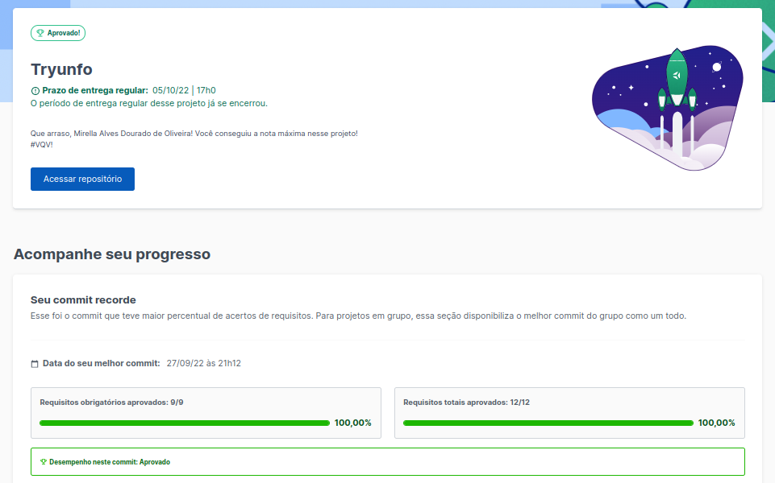
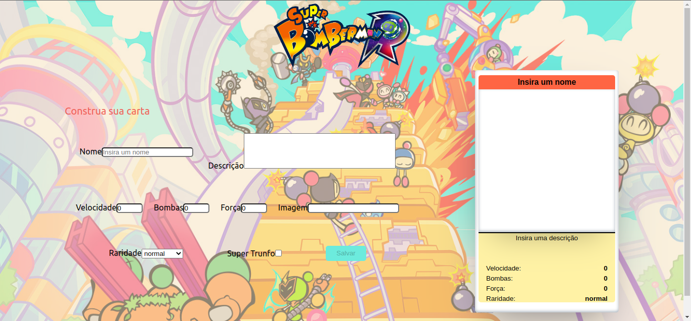

<h1> Welcome to my project Tryunfo! </h1>

<h2> About my project </h2>

 This is a project based on the game Trump(card games) where you can build your deck. The theme is based on BomberMan but you can add any card theme to your deck adding an image's url, name,  description and amount of strength in skills.
 
The main focus on this project is understand Events, Forms and State in React.js based on Trybe's React teachings. 

  
<strong>What is Trybe? 🤷🏽‍♀️</strong>
 

  Trybe is a web development school that is genuinely committed to the professional success of those who study with them. With the Shared Success Model (MSC) offered by Trybe Fintech, a financial institution authorized to operate by the Central Bank of Brazil, students have the option of paying only when they are already working.

<h2> Project Evaluation </h2> 

 On this project my grade was 100%. It means that i did correctly all the requirements in the proposed period. 

<h2> Project Preview </h2> 

<h2>Connect with me </h2>

 For more informations you can contact me: 

